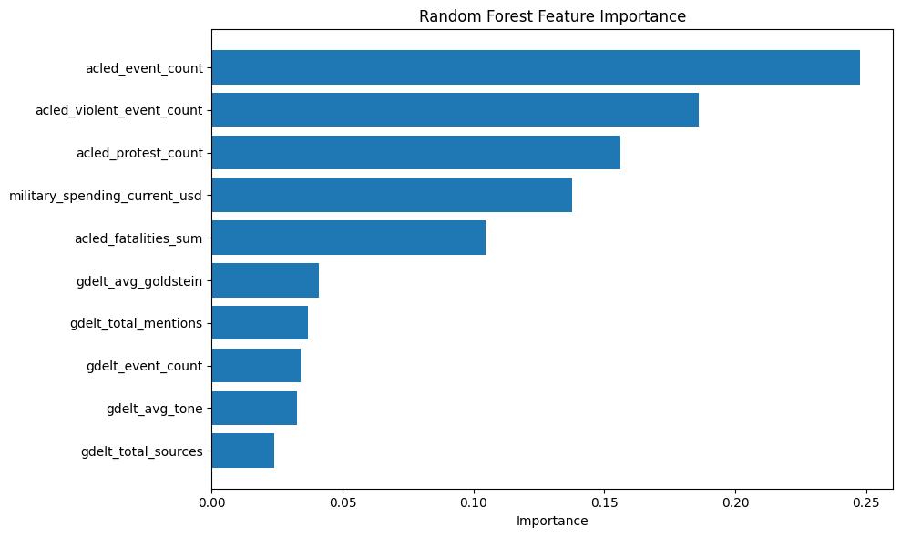
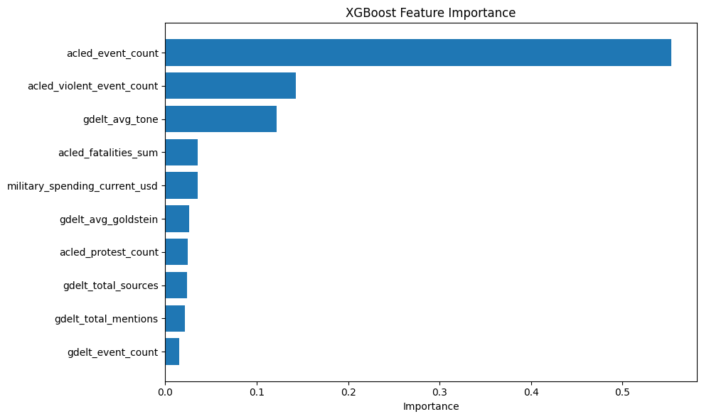
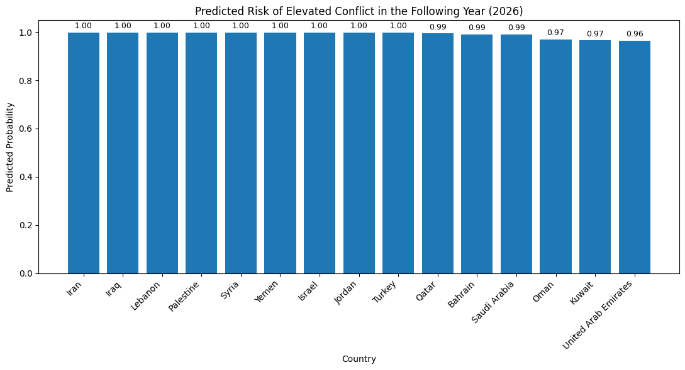

# Master Pipeline for data loading, transformation, machine learning, and evaluation


```python
import duckdb
import pandas as pd
import logging
import os
from pathlib import Path

# Setup logging
logging.basicConfig(
    filename='../logs/pipeline.log',
    level=logging.INFO,
    format='%(asctime)s - %(levelname)s - %(message)s'
)
logger = logging.getLogger(__name__)
```


```python
DB_PATH = '../data/conflict_prediction.duckdb' 
# check for file structure
os.makedirs('../data', exist_ok=True)
os.makedirs('../logs', exist_ok=True)

# setting up logger and connection
con = duckdb.connect(DB_PATH)
logger.info("Connected to DuckDB database")
print("Connected to DuckDB database")

DATA_DIR = '../data/raw' 

# files
FILES = {
    'acled': f'{DATA_DIR}Middle-East_aggregated_data_up_to-2026-03-07.csv',
    'gdelt': f'{DATA_DIR}gdelt_middle_east.csv',
    'sipri': f'{DATA_DIR}SIPRI_current_USD.csv',
    'sipri_per_capita': f'{DATA_DIR}SIPRI_per_capita.csv',
    'fsi_2019': f'{DATA_DIR}fsi-2019.csv',
    'fsi_2020': f'{DATA_DIR}fsi-2020.csv',
    'fsi_2021': f'{DATA_DIR}fsi-2021.csv',
    'fsi_2022': f'{DATA_DIR}fsi-2022.csv',
    'fsi_2023': f'{DATA_DIR}fsi-2023.csv',
    'acled_index': f'{DATA_DIR}ACLED_ci.csv',
    'world_bank': f'{DATA_DIR}World_bank_hist.csv',
}
# making it easier to work with data files

# Verify files exist
for name, path in FILES.items():
    exists = os.path.exists(path)
    status = "FOUND" if exists else "MISSING"
    print(f"  {status}: {name} -> {path}")
    if not exists:
        logger.warning(f"File not found: {path}")
```

    Connected to DuckDB database
      FOUND: acled -> ../data/Middle-East_aggregated_data_up_to-2026-03-07.csv
      FOUND: gdelt -> ../data/gdelt_middle_east.csv
      FOUND: sipri -> ../data/SIPRI_current_USD.csv
      FOUND: sipri_per_capita -> ../data/SIPRI_per_capita.csv
      FOUND: fsi_2019 -> ../data/fsi-2019.csv
      FOUND: fsi_2020 -> ../data/fsi-2020.csv
      FOUND: fsi_2021 -> ../data/fsi-2021.csv
      FOUND: fsi_2022 -> ../data/fsi-2022.csv
      FOUND: fsi_2023 -> ../data/fsi-2023.csv
      FOUND: acled_index -> ../data/ACLED_ci.csv
      FOUND: world_bank -> ../data/World_bank_hist.csv


```python
# Middle East countries with code mappings -- this will make all of the joins super easy
countries_data = {
    'country_code': ['BHR','IRN','IRQ','ISR','JOR','KWT','LBN','OMN','PSE','QAT','SAU','SYR','TUR','ARE','YEM'],
    'country_name': ['Bahrain','Iran','Iraq','Israel','Jordan','Kuwait','Lebanon','Oman','Palestine','Qatar','Saudi Arabia','Syria','Turkey','United Arab Emirates','Yemen'],
    'fips_code': ['BA','IR','IZ','IS','JO','KU','LE','MU','WE','QA','SA','SY','TU','AE','YM'],
    'acled_name': ['Bahrain','Iran','Iraq','Israel','Jordan','Kuwait','Lebanon','Oman','Palestine','Qatar','Saudi Arabia','Syria','Turkey','United Arab Emirates','Yemen'],
    'region': ['Middle East'] * 15,
}

countries_df = pd.DataFrame(countries_data)

# Add World Bank classification if file exists
try:
    wb = pd.read_csv(FILES['world_bank'])
    # Map to our countries
    for idx, row in countries_df.iterrows():
        match = wb[wb['Country'].str.contains(row['country_name'], case=False, na=False)]
        if len(match) > 0:
            countries_df.loc[idx, 'income_group'] = match.iloc[0].get('FY26', 'Unknown')
            countries_df.loc[idx, 'lending_category'] = 'Unknown'
    logger.info("Added World Bank classifications")
except Exception as e:
    # error handling
    logger.warning(f"Could not load World Bank data: {e}")
    countries_df['income_group'] = 'Unknown'
    countries_df['lending_category'] = 'Unknown'

con.execute("DROP TABLE IF EXISTS countries")
con.execute("""
    CREATE TABLE countries AS SELECT * FROM countries_df
""")
print(f"COUNTRIES table created: {con.execute('SELECT COUNT(*) FROM countries').fetchone()[0]} rows")
logger.info("COUNTRIES table created")
```

    COUNTRIES table created: 15 rows


```python
try:
    acled = pd.read_csv(FILES['acled'])
    
    # Rename columns to clean format
    acled.columns = [c.lower().replace(' ', '_') for c in acled.columns]
    
    # Rename week to event_date if needed
    if 'week' in acled.columns:
        acled = acled.rename(columns={'week': 'event_date'})
    
    # Add country_code by mapping from COUNTRIES
    country_map = dict(zip(countries_df['acled_name'], countries_df['country_code']))
    acled['country_code'] = acled['country'].map(country_map)
    
    con.execute("DROP TABLE IF EXISTS acled_events")
    con.execute("""
        CREATE TABLE acled_events AS SELECT * FROM acled
    """)
    
    row_count = con.execute('SELECT COUNT(*) FROM acled_events').fetchone()[0]
    print(f"ACLED_EVENTS table created: {row_count:,} rows")
    logger.info(f"ACLED_EVENTS table created: {row_count} rows")
    
except Exception as e:
    print(f"ERROR loading ACLED: {e}")
    logger.error(f"ACLED loading failed: {e}")
```

    ACLED_EVENTS table created: 144,526 rows


```python
try:
    gdelt = pd.read_csv(FILES['gdelt'], dtype=str, low_memory=False)
    
    # Add country_code by mapping FIPS -> ISO
    fips_map = dict(zip(countries_df['fips_code'], countries_df['country_code']))
    gdelt['country_code'] = gdelt['ActionGeo_CountryCode'].map(fips_map)
    
    # Convert numeric columns
    for col in ['GoldsteinScale', 'NumMentions', 'NumSources', 'NumArticles', 
                'AvgTone', 'ActionGeo_Lat', 'ActionGeo_Long']:
        gdelt[col] = pd.to_numeric(gdelt[col], errors='coerce')

    # Filter only countries we care about
    gdelt_me = gdelt.dropna(subset=['country_code'])
    
    con.execute("DROP TABLE IF EXISTS gdelt_events")
    con.execute("""
        CREATE TABLE gdelt_events AS SELECT * FROM gdelt_me
    """)
    
    row_count = con.execute('SELECT COUNT(*) FROM gdelt_events').fetchone()[0]
    print(f"GDELT_EVENTS table created: {row_count:,} rows")
    logger.info(f"GDELT_EVENTS table created: {row_count} rows")
    
except Exception as e:
    print(f"ERROR loading GDELT: {e}")
    logger.error(f"GDELT loading failed: {e}")
```

    GDELT_EVENTS table created: 2,148,627 rows


```python
try:
    sipri = pd.read_csv(FILES['sipri'])
    
    # SIPRI data is wide format (one column per year) — melt to long format
    id_cols = ['Country', 'Notes']
    year_cols = [c for c in sipri.columns if c not in id_cols]
    
    sipri_long = sipri.melt(
        id_vars=['Country'], 
        value_vars=year_cols,
        var_name='year', 
        value_name='spending_current_usd'
    )
    
    # Clean up
    sipri_long['year'] = pd.to_numeric(sipri_long['year'], errors='coerce')
    sipri_long['spending_current_usd'] = pd.to_numeric(
        sipri_long['spending_current_usd'].replace(['...', 'xxx', '..'], pd.NA), 
        errors='coerce'
    )
    sipri_long = sipri_long.dropna(subset=['year', 'spending_current_usd'])
    sipri_long['year'] = sipri_long['year'].astype(int)
    
    # Filter to Middle East countries and map codes
    me_names = countries_df['country_name'].tolist()
    # SIPRI may use slightly different names, so do fuzzy matching
    name_map = {}
    for sipri_name in sipri_long['Country'].unique():
        for me_name in me_names:
            if me_name.lower() in sipri_name.lower() or sipri_name.lower() in me_name.lower():
                name_map[sipri_name] = me_name
                break
    
    sipri_long['matched_name'] = sipri_long['Country'].map(name_map)
    sipri_me = sipri_long.dropna(subset=['matched_name']).copy()
    
    country_code_map = dict(zip(countries_df['country_name'], countries_df['country_code']))
    sipri_me['country_code'] = sipri_me['matched_name'].map(country_code_map)
    sipri_me = sipri_me[['country_code', 'year', 'spending_current_usd']]
    
    con.execute("DROP TABLE IF EXISTS military_spending")
    con.execute("""
        CREATE TABLE military_spending AS SELECT * FROM sipri_me
    """)
    
    row_count = con.execute('SELECT COUNT(*) FROM military_spending').fetchone()[0]
    print(f"MILITARY_SPENDING table created: {row_count:,} rows")
    logger.info(f"MILITARY_SPENDING table created: {row_count} rows")
    
except Exception as e:
    print(f"ERROR loading SIPRI: {e}")
    logger.error(f"SIPRI loading failed: {e}")
```

    MILITARY_SPENDING table created: 758 rows


```python
try:
    fsi_frames = []
    fsi_keys = [k for k in FILES if k.startswith('fsi_')]
    
    for key in fsi_keys:
        try:
            df = pd.read_csv(FILES[key])
            # Standardize column names
            df.columns = [c.strip() for c in df.columns]
            fsi_frames.append(df)
            print(f"  Loaded {key}: {len(df)} rows, year(s): {df['Year'].unique()}")
        except Exception as e:
            print(f"  Skipped {key}: {e}")
    
    if fsi_frames:
        fsi = pd.concat(fsi_frames, ignore_index=True)
        
        # Standardize column names
        fsi = fsi.rename(columns={
            'S1: Demographic Pressures': 'demographic_pressures',
            'S2: Refugees and IDPs': 'refugees_idps',
            'C3: Group Grievance': 'group_grievance',
            'E3: Human Flight and Brain Drain': 'human_flight',
            'E2: Economic Inequality': 'economic_inequality',
            'E1: Economy': 'economy',
            'P1: State Legitimacy': 'state_legitimacy',
            'P2: Public Services': 'public_services',
            'P3: Human Rights': 'human_rights',
            'C1: Security Apparatus': 'security_apparatus',
            'C2: Factionalized Elites': 'factionalized_elites',
            'X1: External Intervention': 'external_intervention',
            'Total': 'total_score',
            'Country': 'country_name',
            'Year': 'year'
        })
        
        # Map country codes
        code_map = dict(zip(countries_df['country_name'], countries_df['country_code']))
        fsi['country_code'] = fsi['country_name'].map(code_map)
        fsi_me = fsi.dropna(subset=['country_code'])
        
        # Select final columns
        fsi_cols = ['country_code', 'year', 'total_score', 'demographic_pressures',
                    'refugees_idps', 'group_grievance', 'human_flight', 
                    'economic_inequality', 'economy', 'state_legitimacy',
                    'public_services', 'human_rights', 'security_apparatus',
                    'factionalized_elites', 'external_intervention']
        fsi_me = fsi_me[[c for c in fsi_cols if c in fsi_me.columns]]
        
        con.execute("DROP TABLE IF EXISTS fragile_states_index")
        con.execute("""
            CREATE TABLE fragile_states_index AS SELECT * FROM fsi_me
        """)
        
        row_count = con.execute('SELECT COUNT(*) FROM fragile_states_index').fetchone()[0]
        print(f"FRAGILE_STATES_INDEX table created: {row_count:,} rows")
        logger.info(f"FRAGILE_STATES_INDEX table created: {row_count} rows")
        
except Exception as e:
    print(f"ERROR loading FSI: {e}")
    logger.error(f"FSI loading failed: {e}")
```

      Loaded fsi_2019: 2099 rows, year(s): [2019.   nan]
      Loaded fsi_2020: 2099 rows, year(s): [2020.   nan]
      Loaded fsi_2021: 179 rows, year(s): [2021]
      Loaded fsi_2022: 2991 rows, year(s): [2022.   nan]
      Loaded fsi_2023: 179 rows, year(s): [2023]
    FRAGILE_STATES_INDEX table created: 71 rows


```python
try:
    aci = pd.read_csv(FILES['acled_index'])
    
    print(f"  Raw columns: {list(aci.columns)}")
    print(f"  Shape: {aci.shape}")
    print(f"  First few rows:")
    print(aci.head(3))
    
    # Map country codes — check with what prints to make sure everything is correct
    code_map = dict(zip(countries_df['country_name'], countries_df['country_code']))
    
    # Try common column name patterns
    country_col = None
    for candidate in ['Country', 'country', 'Country/Territory', 'Name']:
        if candidate in aci.columns:
            country_col = candidate
            break
    
    if country_col:
        aci['country_code'] = aci[country_col].map(code_map)
        aci_me = aci.dropna(subset=['country_code'])
        
        con.execute("DROP TABLE IF EXISTS acled_conflict_index")
        con.execute("""
            CREATE TABLE acled_conflict_index AS SELECT * FROM aci_me
        """)
        
        row_count = con.execute('SELECT COUNT(*) FROM acled_conflict_index').fetchone()[0]
        print(f"ACLED_CONFLICT_INDEX table created: {row_count:,} rows")
        logger.info(f"ACLED_CONFLICT_INDEX table created: {row_count} rows")
    else:
        print(f"  Could not find country column. Available: {list(aci.columns)}")
        print("  Update the column name mapping above.")
    
except Exception as e:
    print(f"ERROR loading ACLED Conflict Index: {e}")
    logger.error(f"ACLED Conflict Index loading failed: {e}")
```

      Raw columns: ['Country', 'Index Level', 'Index Ranking', 'Deadliness Ranking', 'Diffusion Ranking', 'Danger Ranking', 'Fragmentation Ranking', 'Deadliness Value', 'Diffusion Value', 'Danger Value', 'Fragmentation Value']
      Shape: (244, 11)
      First few rows:
         Country Index Level  Index Ranking  Deadliness Ranking  \
    0  Palestine     Extreme              1                   3   
    1    Myanmar     Extreme              2                   4   
    2      Syria     Extreme              3                   7   
    
       Diffusion Ranking  Danger Ranking  Fragmentation Ranking  Deadliness Value  \
    0                  1               1                      9             18345   
    1                  8               6                      1             15104   
    2                  4               5                      8              9265   
    
       Diffusion Value  Danger Value  Fragmentation Value  
    0            0.691          7811                   69  
    1            0.049          3807                 1244  
    2            0.117          3919                   76  
    ACLED_CONFLICT_INDEX table created: 15 rows


```python
print("\n" + "="*60)
print("DATABASE SUMMARY")
print("="*60)
# summaries

tables = con.execute("SHOW TABLES").fetchall()
for (table_name,) in tables:
    count = con.execute(f"SELECT COUNT(*) FROM {table_name}").fetchone()[0]
    cols = con.execute(f"SELECT * FROM {table_name} LIMIT 0").description
    num_cols = len(cols)
    print(f"  {table_name}: {count:,} rows x {num_cols} columns")

print(f"\nDatabase saved to: {DB_PATH}")
logger.info("All tables loaded successfully")
```

    
    ============================================================
    DATABASE SUMMARY
    ============================================================
      acled_conflict_index: 15 rows x 12 columns
      acled_events: 144,526 rows x 14 columns
      countries: 15 rows x 7 columns
      fragile_states_index: 71 rows x 15 columns
      gdelt_events: 2,148,627 rows x 59 columns
      military_spending: 758 rows x 3 columns
    
    Database saved to: ../data/conflict_prediction.duckdb


```python
# sanity check
print("\n--- Sample Query: ACLED events by country ---")
result = con.execute("""
    SELECT c.country_name, COUNT(*) as event_count, SUM(a.fatalities) as total_fatalities
    FROM acled_events a
    JOIN countries c ON a.country_code = c.country_code
    GROUP BY c.country_name
    ORDER BY total_fatalities DESC
    LIMIT 10
""").fetchdf()
print(result.to_string(index=False))

print("\n--- Sample Query: Military spending for top conflict countries ---")
try:
    result2 = con.execute("""
        SELECT c.country_name, m.year, m.spending_current_usd
        FROM military_spending m
        JOIN countries c ON m.country_code = c.country_code
        WHERE m.year >= 2019
        ORDER BY m.spending_current_usd DESC
        LIMIT 10
    """).fetchdf()
    print(result2.to_string(index=False))
except Exception as e:
    print(f"Query error: {e}")


```

    
    --- Sample Query: ACLED events by country ---
    country_name  event_count  total_fatalities
           Yemen        30946          166972.0
           Syria        28485          142994.0
            Iraq        22541          107616.0
       Palestine         7279           72186.0
            Iran        13115           32811.0
          Turkey        22653            9710.0
    Saudi Arabia         1553            6501.0
         Lebanon         7158            6224.0
          Israel         5629            2040.0
          Jordan         2143             204.0
    
    --- Sample Query: Military spending for top conflict countries ---
    country_name  year  spending_current_usd
    Saudi Arabia  2024               80330.7
    Saudi Arabia  2023               77765.3
    Saudi Arabia  2022               70920.0
    Saudi Arabia  2019               65362.7
    Saudi Arabia  2020               64558.4
    Saudi Arabia  2021               63194.7
          Israel  2024               46505.3
          Israel  2023               27498.5
          Israel  2021               24341.0
          Israel  2022               23406.1


```python
# now that the raw files are added to the db, we can make the tables we would like to work with
con.execute("DROP TABLE IF EXISTS dim_country")

con.execute("""
CREATE TABLE dim_country AS
SELECT
    country_code,
    country_name,
    fips_code,
    acled_name,
    region,
    income_group,
    lending_category
FROM countries
WHERE country_code IS NOT NULL
""")
```


    <duckdb.duckdb.DuckDBPyConnection at 0x11bee5c70>


```python
con.execute("DROP TABLE IF EXISTS fact_acled_event")
# create table acled events
con.execute("""
CREATE TABLE fact_acled_event AS
SELECT
    CAST(id AS BIGINT) AS acled_event_id,
    country_code,
    STRPTIME(date, '%d-%B-%Y') AS event_date,
    EXTRACT(YEAR FROM STRPTIME(date, '%d-%B-%Y')) AS year,
    admin1,
    event_type,
    sub_event_type,
    COALESCE(events, 1) AS events,
    COALESCE(fatalities, 0) AS fatalities,
    population_exposure,
    centroid_latitude AS latitude,
    centroid_longitude AS longitude
FROM acled_events
WHERE country_code IS NOT NULL
  AND date IS NOT NULL
""")
```


    <duckdb.duckdb.DuckDBPyConnection at 0x11bee5c70>


```python
con.execute("DROP TABLE IF EXISTS fact_gdelt_event")
# creating table gdelt events
con.execute("""
CREATE TABLE fact_gdelt_event AS
SELECT
    CAST(GLOBALEVENTID AS BIGINT) AS gdelt_event_id,
    country_code,
    STRPTIME(SQLDATE, '%Y%m%d') AS event_date,
    CAST(Year AS INT) AS year,
    EventRootCode AS event_root_code,
    CAST(QuadClass AS INT) AS quadclass,
    GoldsteinScale AS goldsteinscale,
    NumMentions AS nummentions,
    NumSources AS numsources,
    AvgTone AS avgtone,
    SOURCEURL AS sourceurl
FROM gdelt_events
WHERE country_code IS NOT NULL
  AND SQLDATE IS NOT NULL
""")
```


    <duckdb.duckdb.DuckDBPyConnection at 0x11bee5c70>


### Miltiary Yearly


```python
con.execute("DROP TABLE IF EXISTS military_country_year")
# creating table military country year
con.execute("""
CREATE TABLE military_country_year AS
SELECT
    country_code,
    CAST(year AS INT) AS year,
    spending_current_usd AS military_spending_current_usd
FROM military_spending
WHERE country_code IS NOT NULL
  AND year IS NOT NULL
""")
```


    <duckdb.duckdb.DuckDBPyConnection at 0x11bee5c70>


### FSI Yearly


```python
con.execute("DROP TABLE IF EXISTS fsi_country_year")
# making tabkle fsi country year
con.execute("""
CREATE TABLE fsi_country_year AS
SELECT
    country_code,
    CAST(year AS INT) AS year,
    total_score AS fsi_total_score,
    demographic_pressures,
    refugees_idps,
    group_grievance,
    human_flight,
    economic_inequality,
    economy,
    state_legitimacy,
    public_services,
    human_rights,
    security_apparatus,
    factionalized_elites,
    external_intervention
FROM fragile_states_index
WHERE country_code IS NOT NULL
  AND year IS NOT NULL
""")
```


    <duckdb.duckdb.DuckDBPyConnection at 0x122379bb0>


```python
con.execute("DROP TABLE IF EXISTS acled_country_year")
# creating table acled country year
con.execute("""
CREATE TABLE acled_country_year AS
SELECT
    country_code,
    year,
    COUNT(*) AS acled_event_count,
    SUM(fatalities) AS acled_fatalities_sum,
    SUM(
        CASE
            WHEN event_type IN ('Battles', 'Violence against civilians', 'Explosions/Remote violence')
            THEN 1 ELSE 0
        END
    ) AS acled_violent_event_count,
    SUM(
        CASE
            WHEN event_type = 'Protests'
            THEN 1 ELSE 0
        END
    ) AS acled_protest_count
FROM fact_acled_event
GROUP BY country_code, year
ORDER BY country_code, year
""")

print("acled_country_year created")
print(con.execute("SELECT * FROM acled_country_year LIMIT 10").fetchdf())
```

    acled_country_year created
      country_code  year  acled_event_count  acled_fatalities_sum  \
    0          ARE  2017                  1                   0.0   
    1          ARE  2018                  2                   0.0   
    2          ARE  2019                  2                   0.0   
    3          ARE  2020                  4                   2.0   
    4          ARE  2021                  3                   0.0   
    5          ARE  2022                 21                   3.0   
    6          ARE  2023                  4                   0.0   
    7          ARE  2024                  2                   1.0   
    8          ARE  2025                  4                   0.0   
    9          ARE  2026                 20                   6.0   
    
       acled_violent_event_count  acled_protest_count  
    0                        0.0                  1.0  
    1                        1.0                  1.0  
    2                        1.0                  1.0  
    3                        1.0                  0.0  
    4                        2.0                  0.0  
    5                        6.0                  4.0  
    6                        0.0                  1.0  
    7                        1.0                  1.0  
    8                        2.0                  0.0  
    9                       14.0                  0.0  


```python
con.execute("DROP TABLE IF EXISTS gdelt_country_year")
# gdelt country year
con.execute("""
CREATE TABLE gdelt_country_year AS
SELECT
    country_code,
    year,
    COUNT(*) AS gdelt_event_count,
    AVG(avgtone) AS gdelt_avg_tone,
    AVG(goldsteinscale) AS gdelt_avg_goldstein,
    SUM(nummentions) AS gdelt_total_mentions,
    SUM(numsources) AS gdelt_total_sources
FROM fact_gdelt_event
GROUP BY country_code, year
ORDER BY country_code, year
""")

print("gdelt_country_year created")
print(con.execute("SELECT COUNT(*) AS rows FROM gdelt_country_year").fetchdf())
print(con.execute("SELECT * FROM gdelt_country_year LIMIT 10").fetchdf())
```

    gdelt_country_year created
       rows
    0    93
      country_code  year  gdelt_event_count  gdelt_avg_tone  gdelt_avg_goldstein  \
    0          ARE  2013                  4       -2.656475            -4.500000   
    1          ARE  2014                  2        0.859896            -3.500000   
    2          ARE  2015                  2        2.249244            -8.250000   
    3          ARE  2022                226       -4.086953            -5.403982   
    4          ARE  2023              15342       -2.243299            -5.138140   
    5          ARE  2024              12966       -2.415161            -5.217268   
    6          ARE  2025              11332       -2.316142            -5.171082   
    7          BHR  2022                 35       -3.752996            -4.674286   
    8          BHR  2023               3207       -4.966121            -5.198690   
    9          BHR  2024               2490       -4.832996            -5.332048   
    
       gdelt_total_mentions  gdelt_total_sources  
    0                  18.0                  5.0  
    1                  15.0                  2.0  
    2                  13.0                  2.0  
    3                2552.0                544.0  
    4              162510.0              30990.0  
    5              126972.0              27335.0  
    6              109255.0              19871.0  
    7                 265.0                 52.0  
    8               28994.0               5350.0  
    9               20798.0               3579.0  


```python
con.execute("DROP TABLE IF EXISTS fact_country_year")
# fact country year aswell
con.execute("""
CREATE TABLE fact_country_year AS
WITH all_years AS (
    SELECT country_code, year FROM acled_country_year
    UNION
    SELECT country_code, year FROM gdelt_country_year
    UNION
    SELECT country_code, year FROM military_country_year
    UNION
    SELECT country_code, year FROM fsi_country_year
)
SELECT
    country_code,
    country_name,
    region,
    income_group,
    lending_category,
    year,

    COALESCE(acled_event_count, 0) AS acled_event_count,
    COALESCE(acled_fatalities_sum, 0) AS acled_fatalities_sum,
    COALESCE(acled_violent_event_count, 0) AS acled_violent_event_count,
    COALESCE(acled_protest_count, 0) AS acled_protest_count,

    COALESCE(gdelt_event_count, 0) AS gdelt_event_count,
    gdelt_avg_tone,
    gdelt_avg_goldstein,
    COALESCE(gdelt_total_mentions, 0) AS gdelt_total_mentions,
    COALESCE(gdelt_total_sources, 0) AS gdelt_total_sources,

    military_spending_current_usd,

    fsi_total_score,
    demographic_pressures,
    refugees_idps,
    group_grievance,
    human_flight,
    economic_inequality,
    economy,
    state_legitimacy,
    public_services,
    human_rights,
    security_apparatus,
    factionalized_elites,
    external_intervention

FROM all_years
JOIN dim_country USING (country_code)
LEFT JOIN acled_country_year USING (country_code, year)
LEFT JOIN gdelt_country_year USING (country_code, year)
LEFT JOIN military_country_year USING (country_code, year)
LEFT JOIN fsi_country_year USING (country_code, year)
ORDER BY country_code, year
""")

print("fact_country_year created")
print(con.execute("SELECT COUNT(*) AS rows FROM fact_country_year").fetchdf())
print(con.execute("SELECT * FROM fact_country_year LIMIT 10").fetchdf())
```

    fact_country_year created
       rows
    0   847
      country_code          country_name       region income_group  \
    0          ARE  United Arab Emirates  Middle East            H   
    1          ARE  United Arab Emirates  Middle East            H   
    2          ARE  United Arab Emirates  Middle East            H   
    3          ARE  United Arab Emirates  Middle East            H   
    4          ARE  United Arab Emirates  Middle East            H   
    5          ARE  United Arab Emirates  Middle East            H   
    6          ARE  United Arab Emirates  Middle East            H   
    7          ARE  United Arab Emirates  Middle East            H   
    8          ARE  United Arab Emirates  Middle East            H   
    9          ARE  United Arab Emirates  Middle East            H   
    
      lending_category  year  acled_event_count  acled_fatalities_sum  \
    0          Unknown  1997                  0                   0.0   
    1          Unknown  1998                  0                   0.0   
    2          Unknown  1999                  0                   0.0   
    3          Unknown  2000                  0                   0.0   
    4          Unknown  2001                  0                   0.0   
    5          Unknown  2002                  0                   0.0   
    6          Unknown  2003                  0                   0.0   
    7          Unknown  2004                  0                   0.0   
    8          Unknown  2005                  0                   0.0   
    9          Unknown  2006                  0                   0.0   
    
       acled_violent_event_count  acled_protest_count  ...  group_grievance  \
    0                        0.0                  0.0  ...              NaN   
    1                        0.0                  0.0  ...              NaN   
    2                        0.0                  0.0  ...              NaN   
    3                        0.0                  0.0  ...              NaN   
    4                        0.0                  0.0  ...              NaN   
    5                        0.0                  0.0  ...              NaN   
    6                        0.0                  0.0  ...              NaN   
    7                        0.0                  0.0  ...              NaN   
    8                        0.0                  0.0  ...              NaN   
    9                        0.0                  0.0  ...              NaN   
    
       human_flight  economic_inequality  economy  state_legitimacy  \
    0           NaN                  NaN      NaN               NaN   
    1           NaN                  NaN      NaN               NaN   
    2           NaN                  NaN      NaN               NaN   
    3           NaN                  NaN      NaN               NaN   
    4           NaN                  NaN      NaN               NaN   
    5           NaN                  NaN      NaN               NaN   
    6           NaN                  NaN      NaN               NaN   
    7           NaN                  NaN      NaN               NaN   
    8           NaN                  NaN      NaN               NaN   
    9           NaN                  NaN      NaN               NaN   
    
       public_services  human_rights  security_apparatus  factionalized_elites  \
    0              NaN           NaN                 NaN                   NaN   
    1              NaN           NaN                 NaN                   NaN   
    2              NaN           NaN                 NaN                   NaN   
    3              NaN           NaN                 NaN                   NaN   
    4              NaN           NaN                 NaN                   NaN   
    5              NaN           NaN                 NaN                   NaN   
    6              NaN           NaN                 NaN                   NaN   
    7              NaN           NaN                 NaN                   NaN   
    8              NaN           NaN                 NaN                   NaN   
    9              NaN           NaN                 NaN                   NaN   
    
       external_intervention  
    0                    NaN  
    1                    NaN  
    2                    NaN  
    3                    NaN  
    4                    NaN  
    5                    NaN  
    6                    NaN  
    7                    NaN  
    8                    NaN  
    9                    NaN  
    
    [10 rows x 29 columns]


```python
con.execute("DROP TABLE IF EXISTS model_country_year")
# model country year
con.execute("""
CREATE TABLE model_country_year AS
SELECT
    *,

    LEAD(acled_fatalities_sum) OVER (
        PARTITION BY country_code
        ORDER BY year
    ) AS next_year_fatalities,

    LEAD(acled_event_count) OVER (
        PARTITION BY country_code
        ORDER BY year
    ) AS next_year_event_count,

    CASE
        WHEN LEAD(acled_fatalities_sum) OVER (
            PARTITION BY country_code
            ORDER BY year
        ) > 0
        THEN 1
        ELSE 0
    END AS target_conflict_next_year

FROM fact_country_year
ORDER BY country_code, year
""")

print("model_country_year created")
print(con.execute("SELECT COUNT(*) AS rows FROM model_country_year").fetchdf())
print(con.execute("SELECT * FROM model_country_year LIMIT 10").fetchdf())
```

    model_country_year created
       rows
    0   847
      country_code          country_name       region income_group  \
    0          ARE  United Arab Emirates  Middle East            H   
    1          ARE  United Arab Emirates  Middle East            H   
    2          ARE  United Arab Emirates  Middle East            H   
    3          ARE  United Arab Emirates  Middle East            H   
    4          ARE  United Arab Emirates  Middle East            H   
    5          ARE  United Arab Emirates  Middle East            H   
    6          ARE  United Arab Emirates  Middle East            H   
    7          ARE  United Arab Emirates  Middle East            H   
    8          ARE  United Arab Emirates  Middle East            H   
    9          ARE  United Arab Emirates  Middle East            H   
    
      lending_category  year  acled_event_count  acled_fatalities_sum  \
    0          Unknown  1997                  0                   0.0   
    1          Unknown  1998                  0                   0.0   
    2          Unknown  1999                  0                   0.0   
    3          Unknown  2000                  0                   0.0   
    4          Unknown  2001                  0                   0.0   
    5          Unknown  2002                  0                   0.0   
    6          Unknown  2003                  0                   0.0   
    7          Unknown  2004                  0                   0.0   
    8          Unknown  2005                  0                   0.0   
    9          Unknown  2006                  0                   0.0   
    
       acled_violent_event_count  acled_protest_count  ...  economy  \
    0                        0.0                  0.0  ...      NaN   
    1                        0.0                  0.0  ...      NaN   
    2                        0.0                  0.0  ...      NaN   
    3                        0.0                  0.0  ...      NaN   
    4                        0.0                  0.0  ...      NaN   
    5                        0.0                  0.0  ...      NaN   
    6                        0.0                  0.0  ...      NaN   
    7                        0.0                  0.0  ...      NaN   
    8                        0.0                  0.0  ...      NaN   
    9                        0.0                  0.0  ...      NaN   
    
       state_legitimacy  public_services  human_rights  security_apparatus  \
    0               NaN              NaN           NaN                 NaN   
    1               NaN              NaN           NaN                 NaN   
    2               NaN              NaN           NaN                 NaN   
    3               NaN              NaN           NaN                 NaN   
    4               NaN              NaN           NaN                 NaN   
    5               NaN              NaN           NaN                 NaN   
    6               NaN              NaN           NaN                 NaN   
    7               NaN              NaN           NaN                 NaN   
    8               NaN              NaN           NaN                 NaN   
    9               NaN              NaN           NaN                 NaN   
    
       factionalized_elites  external_intervention  next_year_fatalities  \
    0                   NaN                    NaN                   0.0   
    1                   NaN                    NaN                   0.0   
    2                   NaN                    NaN                   0.0   
    3                   NaN                    NaN                   0.0   
    4                   NaN                    NaN                   0.0   
    5                   NaN                    NaN                   0.0   
    6                   NaN                    NaN                   0.0   
    7                   NaN                    NaN                   0.0   
    8                   NaN                    NaN                   0.0   
    9                   NaN                    NaN                   0.0   
    
       next_year_event_count  target_conflict_next_year  
    0                      0                          0  
    1                      0                          0  
    2                      0                          0  
    3                      0                          0  
    4                      0                          0  
    5                      0                          0  
    6                      0                          0  
    7                      0                          0  
    8                      0                          0  
    9                      0                          0  
    
    [10 rows x 32 columns]


## Model Building

What tables are we going to use for this project? There is such a wide scope we can employ but we would be unable to do anything in a timely manner. Furthermore focusing on the middle east was my main goal, so we need to use what is helpful for our scope. The beauty of this pipeline is that we can do so much more with the data in the future. 


```python
print("\nFinal tables:")
for table in [
    "dim_country",
    "fact_acled_event",
    "fact_gdelt_event",
    "fact_country_year",
    "model_country_year"
]:
    count = con.execute(f"SELECT COUNT(*) FROM {table}").fetchone()[0]
    print(f"{table}: {count:,} rows")
```

    
    Final tables:
    dim_country: 15 rows
    fact_acled_event: 144,526 rows
    fact_gdelt_event: 2,148,627 rows
    fact_country_year: 847 rows
    model_country_year: 847 rows


### Target Varible Split


```python
print("\nTarget balance:")
print(
    con.execute("""
        SELECT
            target_conflict_next_year,
            COUNT(*) AS rows
        FROM model_country_year
        WHERE next_year_fatalities IS NOT NULL
        GROUP BY target_conflict_next_year
        ORDER BY target_conflict_next_year
    """).fetchdf().to_string(index=False)
)
```

    
    Target balance:
     target_conflict_next_year  rows
                             0   700
                             1   132


we are going to need to be picky with how we make our model given this split


```python
# modeling imports
import numpy as np
import matplotlib.pyplot as plt
import pandas as pd
import matplotlib.pyplot as plt

from sklearn.impute import SimpleImputer
from sklearn.ensemble import RandomForestClassifier
from sklearn.metrics import (
    accuracy_score,
    precision_score,
    recall_score,
    f1_score,
    roc_auc_score,
    classification_report,
    ConfusionMatrixDisplay
)

from xgboost import XGBClassifier
```

### Load tables and create the dataframe


```python
con = duckdb.connect("../data/conflict_prediction.duckdb")
# create the database in pandas
df = con.execute("""
    SELECT *
    FROM model_country_year
    ORDER BY country_code, year
""").fetchdf()


print("Shape:", df.shape)
print(df.head())
```

    Shape: (847, 32)
      country_code          country_name       region income_group  \
    0          ARE  United Arab Emirates  Middle East            H   
    1          ARE  United Arab Emirates  Middle East            H   
    2          ARE  United Arab Emirates  Middle East            H   
    3          ARE  United Arab Emirates  Middle East            H   
    4          ARE  United Arab Emirates  Middle East            H   
    
      lending_category  year  acled_event_count  acled_fatalities_sum  \
    0          Unknown  1997                  0                   0.0   
    1          Unknown  1998                  0                   0.0   
    2          Unknown  1999                  0                   0.0   
    3          Unknown  2000                  0                   0.0   
    4          Unknown  2001                  0                   0.0   
    
       acled_violent_event_count  acled_protest_count  ...  economy  \
    0                        0.0                  0.0  ...      NaN   
    1                        0.0                  0.0  ...      NaN   
    2                        0.0                  0.0  ...      NaN   
    3                        0.0                  0.0  ...      NaN   
    4                        0.0                  0.0  ...      NaN   
    
       state_legitimacy  public_services  human_rights  security_apparatus  \
    0               NaN              NaN           NaN                 NaN   
    1               NaN              NaN           NaN                 NaN   
    2               NaN              NaN           NaN                 NaN   
    3               NaN              NaN           NaN                 NaN   
    4               NaN              NaN           NaN                 NaN   
    
       factionalized_elites  external_intervention  next_year_fatalities  \
    0                   NaN                    NaN                   0.0   
    1                   NaN                    NaN                   0.0   
    2                   NaN                    NaN                   0.0   
    3                   NaN                    NaN                   0.0   
    4                   NaN                    NaN                   0.0   
    
       next_year_event_count  target_conflict_next_year  
    0                      0                          0  
    1                      0                          0  
    2                      0                          0  
    3                      0                          0  
    4                      0                          0  
    
    [5 rows x 32 columns]


lets see where we are, and what the splits are looking like for training a model


```python
df = df[df["next_year_fatalities"].notna()].copy()

print("Shape after dropping rows with unknown target:", df.shape)

print("\nTarget counts:")
print(df["target_conflict_next_year"].value_counts())

print("\nTarget proportions:")
print(df["target_conflict_next_year"].value_counts(normalize=True))
```

    Shape after dropping rows with unknown target: (832, 32)
    
    Target counts:
    target_conflict_next_year
    0    700
    1    132
    Name: count, dtype: int64
    
    Target proportions:
    target_conflict_next_year
    0    0.841346
    1    0.158654
    Name: proportion, dtype: float64


```python
target = "target_conflict_next_year"
# splitting target from features
feature_cols = [
    "acled_event_count",
    "acled_fatalities_sum",
    "acled_violent_event_count",
    "acled_protest_count",
    "gdelt_event_count",
    "gdelt_avg_tone",
    "gdelt_avg_goldstein",
    "gdelt_total_mentions",
    "gdelt_total_sources",
    "military_spending_current_usd",
    "fsi_total_score",
    "demographic_pressures",
    "refugees_idps",
    "group_grievance",
    "human_flight",
    "economic_inequality",
    "economy",
    "state_legitimacy",
    "public_services",
    "human_rights",
    "security_apparatus",
    "factionalized_elites",
    "external_intervention"
]

model_df = df[["country_code", "country_name", "year", target] + feature_cols].copy()
```

### Convert to Numeric


```python
for col in feature_cols:
    model_df[col] = pd.to_numeric(model_df[col], errors="coerce")
# converting to numeric and finding missing values
print("Missing values before imputation:")
print(model_df[feature_cols].isna().sum().sort_values(ascending=False))
```

    Missing values before imputation:
    demographic_pressures            756
    refugees_idps                    756
    factionalized_elites             756
    security_apparatus               756
    human_rights                     756
    public_services                  756
    state_legitimacy                 756
    economy                          756
    economic_inequality              756
    human_flight                     756
    group_grievance                  756
    external_intervention            756
    fsi_total_score                  756
    gdelt_avg_goldstein              736
    gdelt_avg_tone                   736
    military_spending_current_usd     74
    acled_fatalities_sum               0
    gdelt_total_sources                0
    gdelt_total_mentions               0
    gdelt_event_count                  0
    acled_protest_count                0
    acled_violent_event_count          0
    acled_event_count                  0
    dtype: int64


Lets see the splits so that we can decide a good cutoff year to train test split. We want to balance the positives with positive rate to get as normal of a split as we can get!


```python
year_summary = (
    model_df.groupby("year")["target_conflict_next_year"]
    .agg(["count", "sum", "mean"])
    .rename(columns={"sum": "positives", "mean": "positive_rate"})
)

print(year_summary)
```

          count  positives  positive_rate
    year                                 
    1950      1          0       0.000000
    1951      2          0       0.000000
    1952      2          0       0.000000
    1953      2          0       0.000000
    1954      2          0       0.000000
    ...     ...        ...            ...
    2021     16         12       0.750000
    2022     16         10       0.625000
    2023     16         12       0.750000
    2024     16         12       0.750000
    2025     15         14       0.933333
    
    [76 rows x 3 columns]


```python
cutoff_year = 2018
# 2018 seemed like the best cutoff we could get given the last cell

train_df = model_df[model_df["year"] <= cutoff_year].copy()
test_df = model_df[model_df["year"] > cutoff_year].copy()

print("Train shape:", train_df.shape)
print("Test shape:", test_df.shape)

print("Train years:", train_df["year"].min(), "to", train_df["year"].max())
print("Test years:", test_df["year"].min(), "to", test_df["year"].max())
```

    Train shape: (721, 27)
    Test shape: (111, 27)
    Train years: 1950 to 2018
    Test years: 2019 to 2025


### Train Test split


```python
X_train = train_df[feature_cols].copy()
X_test = test_df[feature_cols].copy()

y_train = train_df[target]
y_test = test_df[target]
```


```python
print("Train target counts:")
print(y_train.value_counts())
print(y_train.value_counts(normalize=True))

print("\nTest target counts:")
print(y_test.value_counts())
print(y_test.value_counts(normalize=True))
```

    Train target counts:
    target_conflict_next_year
    0    672
    1     49
    Name: count, dtype: int64
    target_conflict_next_year
    0    0.932039
    1    0.067961
    Name: proportion, dtype: float64
    
    Test target counts:
    target_conflict_next_year
    1    83
    0    28
    Name: count, dtype: int64
    target_conflict_next_year
    1    0.747748
    0    0.252252
    Name: proportion, dtype: float64


### Train Random Forest


```python
rf_model = RandomForestClassifier(
    n_estimators=300,
    max_depth=8,
    min_samples_leaf=2,
    class_weight="balanced",
    random_state=42
)
# no hyperparameter optimizaiton due to limitations with training data and scope for the middle east. Addtionally the nature of the
# data does not need much optimization
rf_model.fit(X_train, y_train)

rf_pred = rf_model.predict(X_test)
rf_pred_proba = rf_model.predict_proba(X_test)[:, 1]
```

### XGBoost to enhance


```python
neg = (y_train == 0).sum()
pos = (y_train == 1).sum()
scale_pos_weight = neg / pos
# find scale
print("scale_pos_weight:", scale_pos_weight)
```

    scale_pos_weight: 13.714285714285714


```python
xgb_model = XGBClassifier(
    n_estimators=300,
    max_depth=4,
    learning_rate=0.05,
    subsample=0.9,
    colsample_bytree=0.9,
    scale_pos_weight=scale_pos_weight,
    random_state=42,
    eval_metric="logloss"
)
# similar reasoning to hyperparamters selection for the random forests, wanted a simple model that could still achieve something meaningful
xgb_model.fit(X_train, y_train)

xgb_pred = xgb_model.predict(X_test)
xgb_pred_proba = xgb_model.predict_proba(X_test)[:, 1]
```

## Evaluation

### Confusion Matrices


```python
print("Random Forest Report")
print(classification_report(y_test, rf_pred, zero_division=0))

print("\nXGBoost Report")
print(classification_report(y_test, xgb_pred, zero_division=0))
```

    Random Forest Report
                  precision    recall  f1-score   support
    
               0       0.64      0.25      0.36        28
               1       0.79      0.95      0.86        83
    
        accuracy                           0.77       111
       macro avg       0.71      0.60      0.61       111
    weighted avg       0.75      0.77      0.74       111
    
    
    XGBoost Report
                  precision    recall  f1-score   support
    
               0       0.67      0.29      0.40        28
               1       0.80      0.95      0.87        83
    
        accuracy                           0.78       111
       macro avg       0.73      0.62      0.63       111
    weighted avg       0.76      0.78      0.75       111
    


### Random Forest Feature Importance


```python
rf_importance = pd.DataFrame({
    "feature": feature_cols,
    "importance": rf_model.feature_importances_
}).sort_values("importance", ascending=False)

print(rf_importance.head(10))
```

                             feature  importance
    0              acled_event_count    0.247817
    2      acled_violent_event_count    0.185965
    3            acled_protest_count    0.155981
    9  military_spending_current_usd    0.137516
    1           acled_fatalities_sum    0.104679
    6            gdelt_avg_goldstein    0.040786
    7           gdelt_total_mentions    0.036851
    4              gdelt_event_count    0.033956
    5                 gdelt_avg_tone    0.032726
    8            gdelt_total_sources    0.023724


```python
plt.figure(figsize=(10, 6))
plt.barh(rf_importance["feature"].head(10)[::-1], rf_importance["importance"].head(10)[::-1])
plt.title("Random Forest Feature Importance")
plt.xlabel("Importance")
plt.tight_layout()
plt.show()
```


    

    


### XGBoost Feature Importance


```python
xgb_importance = pd.DataFrame({
    "feature": feature_cols,
    "importance": xgb_model.feature_importances_
}).sort_values("importance", ascending=False)

print(xgb_importance.head(10))
```

                             feature  importance
    0              acled_event_count    0.553803
    2      acled_violent_event_count    0.142644
    5                 gdelt_avg_tone    0.121454
    1           acled_fatalities_sum    0.035492
    9  military_spending_current_usd    0.035476
    6            gdelt_avg_goldstein    0.026144
    3            acled_protest_count    0.024661
    8            gdelt_total_sources    0.023684
    7           gdelt_total_mentions    0.021157
    4              gdelt_event_count    0.015485


```python
plt.figure(figsize=(10, 6))
plt.barh(xgb_importance["feature"].head(10)[::-1], xgb_importance["importance"].head(10)[::-1])
plt.title("XGBoost Feature Importance")
plt.xlabel("Importance")
plt.tight_layout()
plt.show()
```


    

    


```python
import pandas as pd
import matplotlib.pyplot as plt

# Create a results dataframe for the test set
press_df = test_df[["country_code", "country_name", "year", "target_conflict_next_year"]].copy()
press_df["predicted_probability"] = xgb_pred_proba
press_df["predicted_class"] = xgb_pred

# Keep only the most recent test year
latest_year = press_df["year"].max()
latest_df = press_df[press_df["year"] == latest_year].copy()

# Sort by predicted risk
latest_df = latest_df.sort_values("predicted_probability", ascending=False)

print(latest_df)
```

        country_code          country_name  year  target_conflict_next_year  \
    150          IRN                  Iran  2025                          1   
    198          IRQ                  Iraq  2025                          1   
    469          LBN               Lebanon  2025                          1   
    612          PSE             Palestine  2025                          1   
    776          SYR                 Syria  2025                          1   
    845          YEM                 Yemen  2025                          1   
    274          ISR                Israel  2025                          1   
    343          JOR                Jordan  2025                          1   
    790          TUR                Turkey  2025                          1   
    642          QAT                 Qatar  2025                          0   
    83           BHR               Bahrain  2025                          1   
    707          SAU          Saudi Arabia  2025                          1   
    600          OMN                  Oman  2025                          1   
    398          KWT                Kuwait  2025                          1   
    27           ARE  United Arab Emirates  2025                          1   
    
         predicted_probability  predicted_class  
    150               0.999132                1  
    198               0.999095                1  
    469               0.998953                1  
    612               0.998905                1  
    776               0.998847                1  
    845               0.998847                1  
    274               0.998828                1  
    343               0.998294                1  
    790               0.998156                1  
    642               0.994182                1  
    83                0.991084                1  
    707               0.989939                1  
    600               0.970277                1  
    398               0.965648                1  
    27                0.964482                1  


## Visualization

Lets use this model we created to try and predict what is going to happen in 2026! That is what we we were doing with the threshold years when we trained the model. 


```python
plt.figure(figsize=(11, 6))
bars = plt.bar(latest_df["country_name"], latest_df["predicted_probability"])

plt.xticks(rotation=45, ha="right")
plt.ylabel("Predicted Probability")
plt.xlabel("Country")
plt.title(f"Predicted Risk of Elevated Conflict in the Following Year (2026)")

for bar, value in zip(bars, latest_df["predicted_probability"]):
    plt.text(
        bar.get_x() + bar.get_width() / 2,
        bar.get_height() + 0.01,
        f"{value:.2f}",
        ha="center",
        va="bottom",
        fontsize=9
    )

plt.tight_layout()
plt.savefig("predicted_conflict_risk_2025.png", dpi=300, bbox_inches="tight")
plt.show()
```


    

    


yep, as I somewhat though, the middle east is going to be a mess in 2026 -- this really checks out with what the news is showing us.
